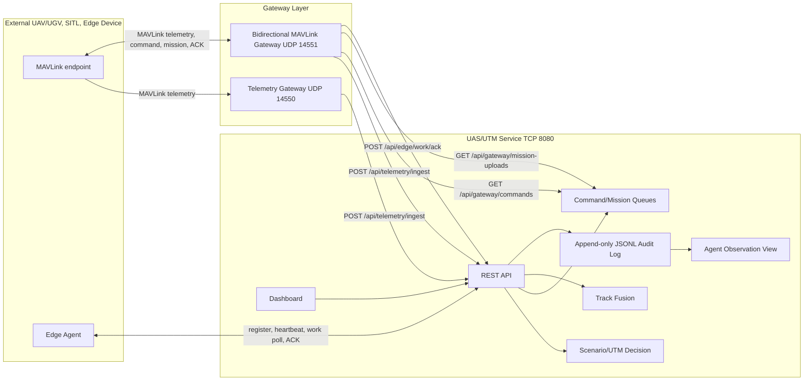

# DAH UAS/UTM 서버 상세 브리핑 및 운영 자료

작성일: 2026-06-26
문서 목적: 구현된 UAS/UTM 서버를 브리핑, 실습, 대회 시나리오 설계, 공격/방어 AI agent 관측 설계에 활용하기 위한 상세 설명서
대상: 대회 운영진, 참가자, UAS/UTM 시나리오 작성자, 방어 agent 개발자, referee/scoring agent 개발자

## 1. 핵심 요약

현재 서버는 UAV/UGV가 포함된 UAS/UTM 정상 운용 환경을 제공한다. Docker Compose로 실행하면 다음 기능이 동시에 올라온다.

- UAS/UTM REST API 및 Dashboard: TCP 8080
- MAVLink telemetry-only gateway: UDP 14550
- MAVLink bidirectional gateway: UDP 14551
- 모의 edge device agent: service API 기반
- append-only audit log 저장소: `logs/uas_utm/audit.jsonl`
- AI agent 관측용 정규화 로그: `/api/logs/agent-view`

이 서버는 현재 단계에서 “대회 준비와 시나리오 구상용 기초 서버”로 적합하다. 본대회 운영용으로는 scoring engine, scenario reset, team isolation, agent submission interface가 추가되어야 한다.

## 2. 실행 구조

### 2.1 Docker Compose 구성

`docker-compose.yml` 기준 서비스는 다음과 같다.

| 서비스 | 역할 | 외부 포트 | 내부 연결 |
| --- | --- | --- | --- |
| `uas-utm-service` | REST API, Dashboard, UTM 상태 관리, 로그 저장 | `8080/tcp` | 다른 컨테이너가 `http://uas-utm-service:8080`로 접근 |
| `uas-utm-gateway` | MAVLink telemetry-only 수신 후 `/api/telemetry/ingest`로 전달 | `14550/udp` | `uas-utm-service`에 HTTP POST |
| `uas-utm-bidir-gateway` | MAVLink telemetry 수신, 승인 command/mission 송신, ACK 기록 | `14551/udp` | `/api/gateway/*`, `/api/edge/work/ack` 사용 |
| `uas-utm-edge-dronebot` | `small-dronebot-01`에 할당된 모의 edge device | 없음 | register, heartbeat, telemetry ingest, work poll |

`uas-utm-service`는 다음 volume을 사용한다.

```yaml
volumes:
  - ./output:/app/output
  - ./logs:/app/logs
```

따라서 컨테이너를 재시작해도 `logs/uas_utm/audit.jsonl`은 host의 `./logs`에 남는다.

### 2.2 실행 명령

Kali 또는 Ubuntu에서:

```bash
cd ~/Desktop/DAH_temp

docker compose up --build
```

특정 구성만 실행:

```bash
# REST API와 Dashboard만

docker compose up --build uas-utm-service

# 양방향 MAVLink gateway까지

docker compose up --build uas-utm-service uas-utm-bidir-gateway
```

브라우저 접속:

```text
http://127.0.0.1:8080
```

기본 상태 확인:

```bash
curl http://127.0.0.1:8080/api/health
curl http://127.0.0.1:8080/api/summary
curl http://127.0.0.1:8080/api/edge/devices
curl http://127.0.0.1:8080/api/logs/status
curl http://127.0.0.1:8080/api/logs/verify
```

## 3. 전체 동작 흐름



## 4. 프로토콜 사용 방법

### 4.1 REST JSON Envelope

모든 REST 응답은 같은 envelope 구조를 따른다.

```json
{
  "protocol": "TTA-UAS-UTM-SIM",
  "schema_version": "1.5",
  "message_id": "uuid",
  "trace_id": "uuid",
  "timestamp_utc": "ISO-8601 UTC",
  "source": "uas-utm-service",
  "message_type": "utm.health",
  "payload": {}
}
```

브리핑 포인트:

- `protocol`: 현재 시뮬레이션 프로파일 이름
- `schema_version`: 서버 envelope schema version
- `message_id`: 개별 응답 식별자
- `trace_id`: 상관관계 추적용 ID
- `timestamp_utc`: 서버 UTC 응답 시각
- `message_type`: 응답 의미
- `payload`: 실제 데이터

### 4.2 주요 REST API

| API | Method | 역할 | 주 사용자 |
| --- | --- | --- | --- |
| `/api/health` | GET | 서비스 생존 확인 | 운영자, 모니터링 |
| `/api/protocol` | GET | 프로토콜 profile 확인 | 개발자 |
| `/api/scenario` | GET | 로딩된 UAV/UGV/C2/zone/mission 확인 | 시나리오 작성자 |
| `/api/summary` | GET | asset/mission/link/MAVLink 요약 | 운영자 |
| `/api/decisions` | GET | UTM mission approval/rejection 결과 | 운영자 |
| `/api/timeline` | GET | replay timeline | UI |
| `/api/live/snapshot` | GET | 특정 시각 live/replay snapshot | UI, agent |
| `/api/live/stream` | GET SSE | telemetry stream | UI, 모니터링 |
| `/api/tracks` | GET | fused track table | 방어 agent |
| `/api/telemetry/ingest` | POST | 외부 telemetry 수신 | gateway, edge |
| `/api/edge/devices/register` | POST | edge device 등록 | edge agent |
| `/api/edge/devices/heartbeat` | POST | edge health 갱신 | edge agent |
| `/api/edge/work` | GET | edge assigned work poll | edge agent |
| `/api/edge/work/ack` | POST | edge work ACK 기록 | edge/gateway |
| `/api/commands` | GET | command queue 조회 | UI, 운영자 |
| `/api/commands/request` | POST | command 요청 | operator |
| `/api/commands/approve` | POST | command 승인 | approver |
| `/api/commands/reject` | POST | command 거절 | approver |
| `/api/mission-uploads` | GET | mission upload queue 조회 | UI, 운영자 |
| `/api/mission-uploads/request` | POST | mission upload 요청 | operator |
| `/api/mission-uploads/approve` | POST | mission upload 승인 | approver |
| `/api/gateway/commands` | GET | gateway가 승인 command polling | bidir gateway |
| `/api/gateway/mission-uploads` | GET | gateway가 승인 mission polling | bidir gateway |
| `/api/logs` | GET | audit log 조회 | 운영자, 분석가 |
| `/api/logs/agent-view` | GET | AI agent용 observation 조회 | agent, 시나리오 설계자 |
| `/api/logs/status` | GET | log storage 상태 | 운영자 |
| `/api/logs/verify` | GET | hash-chain 무결성 검증 | referee, 운영자 |
| `/api/baseline/export` | GET | baseline evidence export | 운영자 |

### 4.3 Server-Sent Events

실시간 telemetry stream은 SSE로 제공된다.

```bash
curl -N "http://127.0.0.1:8080/api/live/stream?interval_ms=1000&max_events=10"
```

응답은 다음 형태다.

```text
event: telemetry
data: { ... envelope ... }
```

사용 목적:

- Dashboard live mode
- 간단한 실시간 관측 agent
- replay 기반 정상 baseline 관찰

주의:

- 현재는 대회 본운영 수준의 backpressure 정책은 없다.
- 장시간 agent 연결을 본격 운영하려면 replay cursor, client id, reconnect policy가 추가되어야 한다.

### 4.4 MAVLink UDP

MAVLink는 두 포트를 구분해서 사용한다.

| 포트 | 서비스 | 방향 | 용도 |
| --- | --- | --- | --- |
| UDP 14550 | `uas-utm-gateway` | 외부 -> 서버 | telemetry ingest only |
| UDP 14551 | `uas-utm-bidir-gateway` | 외부 <-> 서버 | telemetry 수신, command/mission 송신, ACK 수신 |

권장:

- 단순 위치/상태 telemetry만 보낼 때: `14550/udp`
- command/mission을 되돌려 받아야 할 때: `14551/udp`

지원 수신 메시지 예:

- `HEARTBEAT`
- `SYS_STATUS`
- `GLOBAL_POSITION_INT`
- `MISSION_CURRENT`
- `UTM_GLOBAL_POSITION`
- `COMMAND_ACK`
- `MISSION_REQUEST_INT`
- `MISSION_ACK`

지원 송신 메시지 예:

- `COMMAND_LONG`
- `MISSION_COUNT`
- `MISSION_ITEM_INT`

## 5. 외부에서 송수신을 주고받는 방법

### 5.1 같은 Kali host에서 접근

Docker Compose가 다음처럼 ports를 열면 host에서 바로 접근 가능하다.

```yaml
ports:
  - "8080:8080"
  - "14550:14550/udp"
  - "14551:14551/udp"
```

REST API:

```bash
curl http://127.0.0.1:8080/api/health
```

MAVLink endpoint:

```text
udp://127.0.0.1:14551
```

### 5.2 외부 장비에서 Kali host로 접근

외부 장비가 같은 네트워크에 있으면 Kali의 host IP를 확인한다.

```bash
ip addr
```

예를 들어 Kali IP가 `192.168.0.20`이면 외부 장비는 다음으로 전송한다.

```text
REST API: http://192.168.0.20:8080
MAVLink telemetry only: udp://192.168.0.20:14550
MAVLink bidirectional: udp://192.168.0.20:14551
```

UDP port가 열렸는지 확인:

```bash
ss -lun | grep -E '14550|14551'
```

Docker container port 확인:

```bash
docker compose ps
```

### 5.3 MAVProxy 예시

실제 serial device 또는 SITL output을 gateway로 복제할 수 있다.

```bash
mavproxy.py --master=/dev/ttyACM0,57600 --out=udp:192.168.0.20:14551
```

SITL이 local UDP로 떠 있는 경우 예:

```bash
mavproxy.py --master=udp:127.0.0.1:14540 --out=udp:127.0.0.1:14551
```

### 5.4 mavlink-router 예시

```bash
mavlink-routerd -e 192.168.0.20:14551 /dev/ttyACM0:57600
```

SITL endpoint를 route하는 경우:

```bash
mavlink-routerd -e 127.0.0.1:14551 127.0.0.1:14540
```

### 5.5 Mock smoke test

로컬에서 bidirectional gateway가 command를 송신할 수 있는지 확인한다.

```bash
PYTHONPATH=src python -m uas_utm_gateway.mock_smoke_test \
  --service-url http://127.0.0.1:8080 \
  --gateway-host 127.0.0.1 \
  --gateway-port 14551 \
  --asset-id small-dronebot-01
```

예상 동작:

1. mock endpoint가 `GLOBAL_POSITION_INT` 송신
2. service에 `hold_position` command 요청/승인 생성
3. bidir gateway가 `COMMAND_LONG` 송신
4. mock endpoint가 `COMMAND_ACK` 반환
5. service audit log에 ACK 기록

## 6. Command 송수신 실습

### 6.1 Command 요청

```bash
curl -X POST http://127.0.0.1:8080/api/commands/request \
  -H 'Content-Type: application/json' \
  -d '{
    "payload": {
      "asset_id": "small-dronebot-01",
      "command_type": "hold_position",
      "requested_by": "operator-a",
      "priority": 2,
      "params": {"param1": 0}
    }
  }'
```

응답에서 `command_id`를 확인한다.

### 6.2 Command 승인

아래는 `jq`가 있는 경우의 예시다.

```bash
COMMAND_ID=$(curl -s -X POST http://127.0.0.1:8080/api/commands/request \
  -H 'Content-Type: application/json' \
  -d '{"payload":{"asset_id":"small-dronebot-01","command_type":"hold_position","requested_by":"operator-a","priority":2}}' \
  | jq -r '.payload.command_id')

curl -X POST http://127.0.0.1:8080/api/commands/approve \
  -H 'Content-Type: application/json' \
  -d "{\"payload\":{\"command_id\":\"$COMMAND_ID\",\"approver\":\"lead\"}}"
```

`jq`가 없다면 response의 `command_id`를 복사해서 넣으면 된다.

### 6.3 Gateway dispatch 확인

```bash
curl "http://127.0.0.1:8080/api/gateway/commands"
```

승인된 command가 있으면 `approved_for_gateway` 상태로 나온다.

외부 MAVLink endpoint가 `14551/udp`로 telemetry를 보낸 적이 있으면 bidir gateway가 endpoint를 기억하고 `COMMAND_LONG`을 송신한다.

### 6.4 Edge ACK 확인

```bash
curl "http://127.0.0.1:8080/api/logs?event_type=edge_work.acknowledged&limit=20"
```

또는 agent-view로 확인:

```bash
curl "http://127.0.0.1:8080/api/logs/agent-view?limit=50&include_heartbeat=false"
```

## 7. Mission upload 실습

### 7.1 승인 가능한 mission 확인

```bash
curl http://127.0.0.1:8080/api/summary
```

`payload.approved_missions`에 있는 mission만 upload request 가능하다.

### 7.2 Mission upload 요청

```bash
curl -X POST http://127.0.0.1:8080/api/mission-uploads/request \
  -H 'Content-Type: application/json' \
  -d '{
    "payload": {
      "mission_id": "dronebot-local-recon",
      "requested_by": "operator-a"
    }
  }'
```

### 7.3 Mission upload 승인

```bash
UPLOAD_ID=$(curl -s -X POST http://127.0.0.1:8080/api/mission-uploads/request \
  -H 'Content-Type: application/json' \
  -d '{"payload":{"mission_id":"dronebot-local-recon","requested_by":"operator-a"}}' \
  | jq -r '.payload.upload_id')

curl -X POST http://127.0.0.1:8080/api/mission-uploads/approve \
  -H 'Content-Type: application/json' \
  -d "{\"payload\":{\"upload_id\":\"$UPLOAD_ID\",\"approver\":\"lead\"}}"
```

### 7.4 Gateway mission queue 확인

```bash
curl "http://127.0.0.1:8080/api/gateway/mission-uploads"
```

MAVLink handshake:

```text
UTM approved mission upload
  -> gateway sends MISSION_COUNT
  <- vehicle sends MISSION_REQUEST_INT(seq=N)
  -> gateway sends MISSION_ITEM_INT(seq=N)
  <- vehicle sends MISSION_ACK
  -> gateway records /api/edge/work/ack
```

## 8. 로그 종류와 역할

### 8.1 Container stdout log

Docker가 보여주는 로그다.

예:

```text
uas-utm-service-1 | UAS/UTM service listening on http://0.0.0.0:8080
uas-utm-gateway-1 | MAVLink UDP gateway listening on 0.0.0.0:14550
uas-utm-bidir-gateway-1 | Bidirectional MAVLink gateway listening on 0.0.0.0:14551
uas-utm-edge-dronebot-1 | {"heartbeat_status":"online"...}
```

역할:

- 컨테이너 기동 상태 확인
- gateway polling 확인
- edge agent heartbeat 확인
- 서비스 접근 로그 확인

조회:

```bash
docker compose logs -f uas-utm-service
docker compose logs -f uas-utm-bidir-gateway
docker compose logs -f uas-utm-edge-dronebot
```

분석 포인트:

- `listening on`: 정상 기동
- `POST /api/telemetry/ingest 202`: telemetry 수신 정상
- `GET /api/gateway/commands 200`: gateway polling 정상
- `command_count: 0`: 승인된 command 없음
- `mission_upload_count: 0`: 승인된 mission upload 없음

### 8.2 Access log

`uas-utm-service`가 stdout에 찍는 HTTP access log다.

예:

```text
172.18.0.5 - "POST /api/edge/devices/heartbeat HTTP/1.1" 202 -
172.18.0.4 - "GET /api/gateway/commands HTTP/1.1" 200 -
```

역할:

- 어떤 container 또는 host가 어떤 API를 호출했는지 확인
- REST call 성공/실패 status 확인
- polling 주기 확인

상태 코드 해석:

| Status | 의미 |
| --- | --- |
| 200 | GET 성공 |
| 202 | POST 요청 accepted |
| 400 | payload 오류 또는 unknown id |
| 404 | 없는 API 경로 |

### 8.3 Audit JSONL log

파일 기반 append-only 감사 로그다.

경로:

```text
logs/uas_utm/audit.jsonl
```

역할:

- command/mission/edge 이벤트 증적
- hash-chain 기반 변조 탐지
- DAH 제출 evidence
- referee/scoring agent 입력

조회:

```bash
curl "http://127.0.0.1:8080/api/logs?limit=20"
```

직접 파일 확인:

```bash
tail -n 5 logs/uas_utm/audit.jsonl
```

주요 event type:

| event_type | 발생 조건 | 분석 의미 |
| --- | --- | --- |
| `edge_device.registered` | edge device 등록 | 외부/모의 edge identity 등장 |
| `edge_device.heartbeat` | edge heartbeat | edge health 정상성 확인 |
| `command.requested` | operator가 command 요청 | 관제 명령 생성 |
| `command.approved` | approver가 command 승인 | gateway dispatch 가능 상태 |
| `command.rejected` | approver가 command 거절 | 방어/운영 차단 이벤트 |
| `mission_upload.requested` | mission upload 요청 | MAVLink mission 변환 준비 |
| `mission_upload.approved` | mission upload 승인 | gateway mission dispatch 가능 |
| `edge_work.acknowledged` | edge/gateway ACK 수신 | command/mission 수신 또는 처리 피드백 |

### 8.4 Log storage status

```bash
curl http://127.0.0.1:8080/api/logs/status
```

역할:

- 현재 log file 경로 확인
- event count 확인
- 마지막 hash 확인
- 저장 정책 확인

주요 필드:

| 필드 | 의미 |
| --- | --- |
| `profile` | log schema profile |
| `storage_root` | log 저장 디렉터리 |
| `current_file` | 현재 JSONL 파일 |
| `event_count` | 저장된 event 수 |
| `last_hash` | 마지막 event hash |
| `policy` | 저장, 회전, redaction, 무결성 정책 |

### 8.5 Log integrity verify

```bash
curl http://127.0.0.1:8080/api/logs/verify
```

역할:

- JSONL 전체를 다시 읽어 hash-chain 검증
- line별 hash mismatch 탐지
- 제출 전 evidence 검증

정상 예:

```json
{
  "valid": true,
  "checked_count": 15,
  "last_hash": "...",
  "errors": []
}
```

비정상 예:

```json
{
  "valid": false,
  "errors": [
    {"line": 4, "error": "event_hash_mismatch"}
  ]
}
```

해석:

- `valid=true`: 현재 파일 내 hash-chain 무결성 정상
- `previous_hash_mismatch`: 중간 event가 삭제/삽입/재정렬되었을 가능성
- `event_hash_mismatch`: event 본문이 수정되었을 가능성

### 8.6 Agent View log

AI agent가 사용하기 쉬운 정규화 관측 view다.

```bash
curl "http://127.0.0.1:8080/api/logs/agent-view?limit=50"
```

heartbeat가 너무 많을 때:

```bash
curl "http://127.0.0.1:8080/api/logs/agent-view?limit=50&include_heartbeat=false"
```

command workflow만:

```bash
curl "http://127.0.0.1:8080/api/logs/agent-view?phase=c2_command_workflow&limit=20"
```

mission workflow만:

```bash
curl "http://127.0.0.1:8080/api/logs/agent-view?phase=mission_planning_workflow&limit=20"
```

edge feedback만:

```bash
curl "http://127.0.0.1:8080/api/logs/agent-view?phase=edge_execution_feedback&limit=20"
```

Agent View 필드:

| 필드 | 의미 | Agent 활용 |
| --- | --- | --- |
| `event_family` | command, mission_upload, edge_device 등 | 큰 분류 |
| `phase` | workflow 단계 | 상태 machine 입력 |
| `perspectives` | blue_defense, red_scenario_planning | agent 역할 분기 |
| `subject.actor` | 수행 주체 | 권한/역할 확인 |
| `object.asset_id` | 대상 asset | asset별 정책 적용 |
| `action` | requested, approved, rejected, ack 등 | 상태 전이 |
| `outcome` | recorded, online, approved_for_gateway 등 | 결과 판단 |
| `risk_score` | 0.0-1.0 위험도 | 우선순위 큐 |
| `labels` | tag 목록 | 규칙/모델 feature |
| `features` | boolean/numeric feature map | ML/룰 기반 입력 |
| `defense_questions` | 방어 agent 점검 질문 | explanation 생성 |
| `scenario_hooks` | 시나리오 설계 hook | 대회 시나리오 설계 |

## 9. 로그 분석법

### 9.1 현재 서버가 정상인지 판단

```bash
curl -s http://127.0.0.1:8080/api/health | jq '.payload'
```

정상:

```json
{
  "ok": true,
  "scenario": "korea_defense_uas_utm_ops_stage_2"
}
```

### 9.2 Edge device 상태 분석

```bash
curl -s http://127.0.0.1:8080/api/edge/devices | jq '.payload.edge_devices[]'
```

확인할 필드:

- `status`: `online`이면 정상
- `last_seen_utc`: 최근 heartbeat 시간
- `health.cpu_load`: 과도하게 높으면 이상 가능
- `health.link_quality`: 낮으면 통신 품질 문제
- `asset_ids`: 의도한 asset에만 할당되었는지 확인
- `egress_policy`: `approved_queue_only`인지 확인

### 9.3 Command workflow 분석

```bash
curl -s "http://127.0.0.1:8080/api/logs/agent-view?phase=c2_command_workflow&limit=50" \
  | jq '.payload.observations[] | {time:.timestamp_utc,event:.event_type,actor:.subject.actor,asset:.object.asset_id,risk:.risk_score,labels:.labels}'
```

정상 sequence:

```text
command.requested -> command.approved -> edge_work.acknowledged
```

주의할 상태:

- `command.requested`만 있고 승인/거절 없음: operator workflow가 멈춤
- `command.approved` 후 ACK 없음: gateway/edge/device 연동 확인 필요
- `command.rejected` 다수 발생: policy, mission context, operator 입력 확인 필요

### 9.4 Mission workflow 분석

```bash
curl -s "http://127.0.0.1:8080/api/logs/agent-view?phase=mission_planning_workflow&limit=50" \
  | jq '.payload.observations[] | {event:.event_type,mission:.object.mission_id,asset:.object.asset_id,items:.features.mavlink_item_count,risk:.risk_score}'
```

정상 sequence:

```text
mission_upload.requested -> mission_upload.approved -> edge_work.acknowledged
```

주의할 상태:

- UTM-approved mission이 아닌데 upload 요청: API가 거절해야 정상
- mission item count가 0: route 변환 문제 가능
- 승인 후 ACK 없음: MAVLink mission handshake 확인 필요

### 9.5 Heartbeat noise 제외

edge heartbeat는 2초마다 쌓일 수 있다. 최근 로그 10개가 heartbeat로만 보이면 다음처럼 제외한다.

```bash
curl -s "http://127.0.0.1:8080/api/logs/agent-view?limit=50&include_heartbeat=false" \
  | jq '.payload.observations[].event_type'
```

### 9.6 Hash-chain 검증

```bash
curl -s http://127.0.0.1:8080/api/logs/verify | jq '.payload'
```

대회 evidence로 제출할 때는 다음을 캡처한다.

- `valid`
- `checked_count`
- `last_hash`
- `errors`

### 9.7 Track fusion 분석

```bash
curl -s "http://127.0.0.1:8080/api/tracks?time_s=120" \
  | jq '.payload.tracks[] | {asset:.asset_id,primary:.primary_source_id,confidence:.confidence,stale:.stale,sources:.source_count}'
```

해석:

- `mode=single_source`: simulation 또는 외부 source 하나만 사용
- `mode=fused`: simulation + external telemetry 등이 결합됨
- `stale=true`: 해당 source가 오래됨
- `confidence`가 낮음: source 신뢰도 또는 freshness 문제

### 9.8 MAVLink message 분석

```bash
curl -s "http://127.0.0.1:8080/api/mavlink?limit=20" \
  | jq '.payload.messages[] | {time:.time_s,asset:.asset_id,msg:.message.message_name,sys:.message.system_id}'
```

asset별:

```bash
curl -s "http://127.0.0.1:8080/api/mavlink?asset_id=small-dronebot-01&limit=20" | jq '.payload.messages[]'
```

## 10. 대회 시나리오 설계에서 로그를 쓰는 방법

### 10.1 Blue defense agent 설계

입력 추천:

- `/api/logs/agent-view?include_heartbeat=false`
- `/api/tracks`
- `/api/edge/devices`
- `/api/logs/verify`

주요 판단:

- 승인된 command가 정상 mission context와 맞는가?
- command 승인 후 edge ACK가 도착했는가?
- edge heartbeat가 정상 범위인가?
- track source가 stale 상태인가?
- log hash-chain이 valid인가?

규칙 예:

```text
IF event.phase == c2_command_workflow
AND event.features.status_approved_for_gateway == true
AND no edge_work.acknowledged within expected window
THEN raise defense alert: missing_edge_ack
```

### 10.2 Red scenario planner 설계

이 서버는 실제 공격 절차를 제공하지 않는다. 대신 시나리오 설계자는 agent-view의 `scenario_hooks`를 보고 “어떤 정상 workflow를 흔들어볼지”를 안전하게 구상할 수 있다.

예:

- `approval_chain_validation_candidate`: 승인 chain 검증 시나리오
- `route_or_mission_integrity_validation_candidate`: mission route 검증 시나리오
- `edge_identity_and_health_validation_candidate`: edge identity/health 검증 시나리오
- `edge_feedback_latency_and_origin_validation_candidate`: ACK 지연/출처 검증 시나리오

### 10.3 Referee/scoring agent 설계

입력 추천:

- audit JSONL
- `/api/logs/verify`
- `/api/logs/agent-view`
- `/api/baseline/export`

채점 후보:

| 항목 | 근거 로그 | 점수화 예 |
| --- | --- | --- |
| 승인 절차 준수 | command.requested, command.approved | 순서가 맞으면 가점 |
| 거절 판단 | command.rejected | 위험 command 차단 시 가점 |
| edge ACK | edge_work.acknowledged | 지연이 짧으면 가점 |
| mission integrity | mission_upload.* | 승인 mission만 upload되면 가점 |
| log integrity | /api/logs/verify | valid=true 필수 조건 |
| track freshness | /api/tracks | stale=false 유지 가점 |

## 11. 문제 상황별 진단

### 11.1 `/api/health`가 안 된다

확인:

```bash
docker compose ps
docker compose logs uas-utm-service
```

가능 원인:

- 컨테이너 미기동
- port 8080 충돌
- scenario 파일 오류
- build 실패

### 11.2 edge device가 안 보인다

확인:

```bash
docker compose logs uas-utm-edge-dronebot
curl http://127.0.0.1:8080/api/edge/devices
```

가능 원인:

- edge agent 컨테이너 미기동
- service URL 오류
- asset id 불일치
- register payload 오류

### 11.3 command_count가 계속 0이다

의미:

- 승인된 command가 없다는 뜻이다.
- `Request Hold`만 누르고 `Approve`를 안 했을 수 있다.
- 외부 gateway는 `/api/gateway/commands`에서 `approved_for_gateway`만 가져간다.

확인:

```bash
curl http://127.0.0.1:8080/api/commands
curl "http://127.0.0.1:8080/api/commands?status=pending_approval"
curl "http://127.0.0.1:8080/api/commands?status=approved_for_gateway"
```

### 11.4 bidirectional gateway가 command를 안 보낸다

확인:

```bash
docker compose logs uas-utm-bidir-gateway
curl "http://127.0.0.1:8080/api/gateway/commands"
```

가능 원인:

- 승인된 command 없음
- 외부 MAVLink endpoint가 telemetry를 보낸 적 없음
- system_id가 scenario asset과 매핑되지 않음
- UDP 14551 접근 불가

### 11.5 agent-view가 heartbeat만 보인다

이유:

- edge heartbeat가 주기적으로 많이 쌓이기 때문이다.

해결:

```bash
curl "http://127.0.0.1:8080/api/logs/agent-view?limit=50&include_heartbeat=false"
```

또는 command workflow만 필터링한다.

```bash
curl "http://127.0.0.1:8080/api/logs/agent-view?phase=c2_command_workflow&limit=20"
```

### 11.6 log verify가 false다

의미:

- JSONL 파일이 중간에 수정, 삭제, 삽입, 재정렬되었을 가능성이 있다.

조치:

1. `errors`의 line 확인
2. 해당 line 주변을 backup과 비교
3. 대회 evidence로 사용하지 않음
4. scenario reset 또는 새 run id로 재시작

## 12. 발표용 설명 스크립트

다음 순서로 말하면 된다.

1. 이 서버는 UAS/UTM 정상 운용 baseline을 재현하는 시뮬레이션 서버다.
2. UAV/UGV, mission, C2 node, air/ground zone을 scenario로 로딩한다.
3. Dashboard는 지도와 상태를 보여주고, command/mission approval workflow를 제공한다.
4. 외부 UAV/UGV 또는 SITL은 MAVLink UDP로 telemetry를 보낼 수 있다.
5. 양방향 gateway는 승인된 command와 mission만 외부 endpoint로 송신한다.
6. edge device는 register, heartbeat, work poll, ACK 흐름으로 UTM과 통신한다.
7. 모든 핵심 이벤트는 append-only JSONL audit log로 저장된다.
8. log는 SHA-256 hash-chain으로 무결성을 검증한다.
9. AI agent는 원본 log 대신 `/api/logs/agent-view`를 사용하면 risk, label, feature, defense question을 바로 받을 수 있다.
10. 현재 서버는 대회 준비와 시나리오 설계에는 충분하지만, 본대회 운영에는 scoring, reset, team isolation이 추가되어야 한다.

## 13. 본대회 전 추가 구현 우선순위

1. Scoring engine
   - command 승인 순서
   - ACK 지연
   - baseline deviation
   - log integrity

2. Scenario reset/run 관리
   - run id
   - seed 고정
   - log archive
   - baseline snapshot

3. Team isolation
   - team id
   - operator/approver role
   - team별 scenario namespace

4. Safe anomaly injection
   - stale telemetry
   - impossible route
   - missing ACK
   - unexpected command request

5. Agent submission interface
   - observation polling
   - recommendation submission
   - scoring feedback

6. 운영자 admin panel
   - scenario start/stop/reset
   - team status
   - log verify
   - score export

## 14. 빠른 확인 명령 모음

```bash
# 서비스 상태
curl http://127.0.0.1:8080/api/health

# edge 상태
curl http://127.0.0.1:8080/api/edge/devices

# track 상태
curl "http://127.0.0.1:8080/api/tracks?time_s=120"

# command queue
curl http://127.0.0.1:8080/api/commands

# mission upload queue
curl http://127.0.0.1:8080/api/mission-uploads

# gateway dispatch queue
curl http://127.0.0.1:8080/api/gateway/commands
curl http://127.0.0.1:8080/api/gateway/mission-uploads

# audit log
curl "http://127.0.0.1:8080/api/logs?limit=20"

# heartbeat 제외 agent view
curl "http://127.0.0.1:8080/api/logs/agent-view?limit=50&include_heartbeat=false"

# command workflow agent view
curl "http://127.0.0.1:8080/api/logs/agent-view?phase=c2_command_workflow&limit=20"

# log storage 상태 및 무결성
curl http://127.0.0.1:8080/api/logs/status
curl http://127.0.0.1:8080/api/logs/verify

# baseline export
curl http://127.0.0.1:8080/api/baseline/export
```
