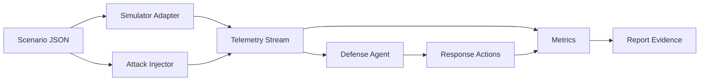

# UAV/UGV 테스트 스택 및 하네스 계획

## 설계 원칙

- 예선에서는 본선 시뮬레이터가 공개되지 않았으므로 simulator-agnostic 하네스를 먼저 만든다.
- 공격, 방어, 평가 로직은 시뮬레이터 어댑터와 분리한다.
- 보고서에 바로 넣을 수 있는 로그, 표, 다이어그램을 산출한다.
- 본선 공지가 나오면 ROS2/MAVLink/Gazebo 입력을 같은 telemetry schema로 변환한다.

## 권장 스택

| 레이어 | 예선 프로토타입 | 본선 확장 후보 | 목적 |
| --- | --- | --- | --- |
| Scenario DSL | JSON | JSON/YAML + schema validation | 반복 가능한 공격/방어 시나리오 |
| Digital twin | Python stdlib | Gazebo, PX4 SITL, ArduPilot SITL | 경로, 센서, 링크, 명령 흐름 재현 |
| UAV interface | Internal adapter | MAVLink, MAVSDK, PX4 uORB bridge | UAV telemetry/command 연결 |
| UGV interface | Internal adapter | ROS2, Nav2, Gazebo plugin | UGV localization/navigation 연결 |
| Attack injector | Python modules | MAVLink proxy, ROS2 topic mutator | GPS spoofing, command injection, jamming |
| Defense agent | Rule-based monitor | ML anomaly detection + LLM planner | 탐지, 대응, 복구 |
| Metrics | JSON summary | MLflow/W&B, parquet logs | 튜닝 비교와 보고서 증거 |
| Packaging | Dockerfile | compose + simulator images | 재현 가능한 제출 환경 |

## 하네스 아키텍처

## UAV/UGV 위협 시나리오 후보

| 시나리오 | 공격 표면 | 방어 포인트 | 하네스 지표 |
| --- | --- | --- | --- |
| GNSS spoofing | UAV/UGV 위치 신뢰 경계 | 위치 점프, 계획 경로 이탈, hold/RTB | 탐지율, 지연, 경로 이탈 |
| Command injection | 명령 채널, mission item | 명령 목표 검증, channel quarantine | 차단 성공률, 오탐 |
| Link jamming | telemetry/control link | link-loss timer, fail-safe mode | 복구 시간, 미션 영향 |
| Sensor desync | IMU/GNSS/odometry fusion | 센서 간 일관성 검사 | anomaly score |
| Cooperative convoy disruption | UAV-UGV 협업 루프 | asset-level isolation, fallback plan | 전체 미션 진행률 |

## AI 에이전트 역할 분해

| 에이전트 | 입력 | 출력 | 구현 상태 |
| --- | --- | --- | --- |
| Attack Planner | 시나리오, asset capability | 공격 window와 parameter | JSON scenario로 표현 |
| Attack Executor | telemetry/control stream | 변조된 telemetry/command | `attacks.py` |
| Defense Monitor | telemetry frame | anomaly reason, severity | `defense.py` |
| Response Recommender | anomaly context | hold, stop, quarantine, RTB | `defense.py` |
| Evaluator | attack log, action log | metric summary | `metrics.py` |

예선 보고서에서는 위 구조를 "LLM planner + deterministic executor"로 설명한다. 실제 시스템 제어는
검증 가능한 executor가 수행하고, LLM은 시나리오 생성, 로그 해석, 대응 추천을 담당하도록 제한한다.

## 튜닝 전략

1. baseline threshold로 모든 공격을 실행한다.
2. `--set key=value`로 하나의 threshold만 바꿔 재실행한다.
3. `detection_rate`가 떨어지지 않는 범위에서 `false_positive_actions`를 줄인다.
4. `mean_detection_latency_s`가 커지면 threshold를 낮추거나 link-loss timer를 줄인다.
5. 최종 threshold와 metric JSON을 보고서 표로 옮긴다.

현재 튜닝 파라미터:

| 파라미터 | 의미 | 기본값 |
| --- | --- | ---: |
| `gps_jump_threshold_m` | 한 step 위치 급변 탐지 | 40 |
| `route_deviation_threshold_m` | 계획 위치 대비 보고 위치 이탈 | 60 |
| `command_deviation_threshold_m` | 명령 목표가 nominal target에서 벗어난 거리 | 45 |
| `link_loss_threshold_s` | 연속 link loss 허용 시간 | 5 |
| `quarantine_score_threshold` | 강한 격리 대응을 내릴 anomaly score | 2 |

## 본선 인터페이스 공개 후 연결 지점

`TelemetryFrame`은 외부 시뮬레이터와 하네스 사이의 boundary입니다. 본선 환경이 공개되면 다음
adapter만 추가합니다.

- MAVLink adapter: `GLOBAL_POSITION_INT`, `LOCAL_POSITION_NED`, `MISSION_ITEM`, `COMMAND_LONG`
- ROS2 adapter: `/tf`, `/odom`, `/cmd_vel`, `/navsat/fix`, `/mission_state`
- Log replay adapter: CSV/JSON/parquet telemetry를 `TelemetryFrame`으로 변환

방어/평가 로직은 `TelemetryFrame`만 의존하므로 교체하지 않습니다.

## 보고서 증거 산출물

- `output/harness_summary.json`: metric summary
- `output/tuned_summary.json`: threshold 변경 후 metric summary
- CLI stdout: 탐지 action 개요
- `tests/` 결과: 프로토타입 회귀 테스트 통과 증거
- 이 문서의 아키텍처 다이어그램
